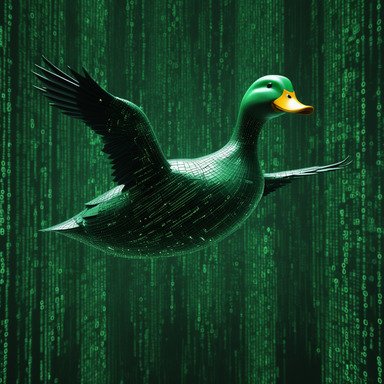

<div align="center">

# Lair

CLI Tools for Working With Generative AI

[Installation](#installation) |
[Configuration](#configuration) |
[Features](#features)

Modules: [Chat](#chat---command-line-chat-interface) |
[Comfy](#comfy) |
[Util](#util)

</div>

<!-- markdown-toc start - Don't edit this section. Run M-x markdown-toc-refresh-toc -->
**Table of Contents**

- [Overview](#overview)
- [Features](#features)
- [Future](#future)
- [Installation](#installation)
- [Configuration](#configuration)
- [Usage](#usage)
  - [Lair Core](#lair-core)
  - [Chat - Command Line Chat Interface](#chat---command-line-chat-interface)
    - [Commands](#commands)
    - [Shortcut Keys](#shortcut-keys)
    - [Chat Examples](#chat-examples)
      - [Attaching images](#attaching-images)
      - [One-off Chat](#one-off-chat)
    - [Model Settings](#model-settings)
    - [Session Management](#session-management)
  - [Comfy](#comfy)
    - [Workflows and Dependencies](#workflows-and-dependencies)
    - [Comfy Usage & Examples](#comfy-usage--examples)
      - [image - Image Generation](#image---image-generation)
      - [ltxv-i2v - LTX Video Image to Video](#ltxv-i2v---ltx-video-image-to-video)
      - [ltxv-prompt - LTX Video Prompt Generation via Florence2](#ltxv-prompt---ltx-video-prompt-generation-via-florence2)
  - [Util](#util)
    - [Util Examples](#util-examples)
      - [Generating Content](#generating-content)
      - [Providing Input Content](#providing-input-content)
      - [Attaching Images](#attaching-images)

<!-- markdown-toc end -->


## Overview

Lair is a set of utilities and tools for working with generative AI. This repository contains an open source version of Lair. The open source version currently provides some general purpose functionality, such as a command line chat interface and a one-off utility command.

The full lair repository has various other features such as an agent framework, tools for evolutionary programming with LLMs, and a tool for creating non-temporal videos from image diffusion models. Some hints of other features might still exist in the code, but a lot of modules were not included. If there is interest, over time I might add some of the other functionality into the open source version.

## Features

* **chat**: Command line chat interface
  * Rich interface w/ auto-complete, commands, shortcuts, etc
  * File based session management
  * Support for image file attachments
  * Markdown rendering & syntax highlighting

* **comfy**: Run workflows on ComfyUI
  * Image diffusion & LTX Video image-to-video support
  * Simple interface for command line usage and scripting

* **util**: Unix-style utility for scripting or one-off LLM usage
  * Simple I/O for sending content via file or pipes to LLMs
  * Support for image file attachments

## Future

As this is a hobby project, there is no roadmap or guarantee that anything will be addressed, but these are the next big features and fixes I'd like to see added in:

* Support for attaching other formats, such as PDF and TXT files.
* Support for tools in chat. This existed in an older unreleased version of lair, but a refactor removed langchain, and with it tools support.
    * A search tool should be added, allowing the LLM to use a search engine and read the results.
* Support for external sub-command and module loading.

As an experiment, a [GitHub project exists](https://github.com/users/DougHaber/projects/1) to track possible improvements. This might change in the future.

## Installation

Lair is installed as a Python command, requiring Python 3.10 or greater to be installed. Any Python package management tool could install lair (such as pip, pipx, and uv.) For most users, pipx or uv are probably the best options.

```sh
pipx install git+https://github.com/DougHaber/lair.git@0.2.0
```

Replace `0.2.0` with the latest version. The `master` branch will contain the latest unreleased version. Official releases will be tagged using semantic versioning.

## Configuration

In Lair, configuration is a set of namespaced key value pairs. All pairs could be found [here](lair/files/settings.yaml). Types are enforced and attempting to set a key to a different type of value will result in an error.

When lair is first run it will create `~/.lair/config.yaml`. Within this file, modes can be defined to which enable different settings. A mode is a named collection of settings. Modes can be used to jump between different configurations very quickly. The top level `default_mode` key allows specifying the default mode to use if none is specified.

YAML anchors and aliasing can be used to make nodes inherit from each other. An experimental feature also exists where a key `_inherit` can contain a list of other modes to inherit from. The modes to inherit from must be defined above the point they are referenced. While this feature is enabled, it should be considered experimental, and behaviors might change in the future.

In the current release, the only supported `session.type` is `openai_chat`, which uses OpenAI's API or other APIs that provide compatibility, such as with ollama. Lair was originally using langchain and supported various other options which have been removed to simplify the code.

To use Lair with OpenAI, set the environment variable `OPENAI_API_KEY` with your key. The default environment variable to use can be modified with `openai.api_key_environment_variable`.

To use with other OpenAI-compatible APIs, such as ollama, set the configuration variable `openai.api_base`. For example, to use an ollama endpoint: `openai.api_base: http://localhost:11434/v1`.

## Usage

### Lair Core

The following flags are supported when using the `lair` command. They must be provided before the sub-command.

```
  -h, --help               show this help message and exit
  --debug, -d              Enable debugging output
  --disable-color, -c      Do not use color escape sequences
  --force-color, -C        Use color escape sequences, even in pipes
  -M MODE, --mode MODE     Name of the predefined mode to use
  -m MODEL, --model MODEL  Name of the model to use
  -s SET, --set SET        Set a configuration value (-s key=value)
  --version                Display the current version and exit
```

The `--mode` / `-M` flag allows changing the mode (and with it any configuration at startup.)

Individual settings may be overridden with the `--set` / `-s` flag. For example `lair -s 'style.error=bold red' -s ui.multline_input=true chat`.

The `--model` / `-m` flag is a shorthand for setting `model.name`.

### Chat - Command Line Chat Interface

The `chat` command provides a rich command-line interface for interacting with large language models.

Much of the interface is customizable through overriding `display.*` settings. See [here](lair/files/settings.yaml) for a full reference for those settings.

The bottom-toolbar by default shows flags like `[lMvW]`. Flags that are enabled show with capital letters and brighter colors. The current flags are:

| Flag | Meaning                    | Shortcut Key |
|------|----------------------------|--------------|
| L    | Multi-line input           | ESC-L        |
| M    | Markdown rendering         | ESC-M        |
| V    | Verbose (currently unused) | ESC-V        |
| W    | Word-wrapping              | ESC-W        |

#### Commands

| Command          | Description                                                                                               |
|------------------|-----------------------------------------------------------------------------------------------------------|
| /clear           | Clear the conversation history                                                                            |
| /comfy           | Call ComfyUI workflows                                                                                    |
| /debug           | Toggle debugging                                                                                          |
| /help            | Show available commands and shortcuts                                                                     |
| /history         | Show current conversation                                                                                 |
| /last-prompt     | Display the most recently used prompt                                                                     |
| /last-response   | Display the most recently seen response                                                                   |
| /list-models     | Display a list of available models for the current session                                                |
| /load            | Load a session from a file  (usage: `/load [filename?]`, default filename is `chat_session.json`)         |
| /mode            | Show or select a mode  (usage: `/mode [name?]`)                                                           |
| /model           | Show or set a model  (usage: `/model [name?]`)                                                            |
| /prompt          | Show or set the system prompt  (usage: `/prompt [prompt?]`)                                               |
| /reload-settings | Reload settings from disk  (resets everything, except current mode)                                       |
| /save            | Save the current session to a file  (usage: `/save [filename?]`, default filename is `chat_session.json`) |
| /set             | Show configuration or set a configuration value for the current mode  (usage: `/set ([key?] [value?])?`)  |

#### Shortcut Keys

In addition to all the standard GNU-readline style key combinations, the following shortcuts are provided.

| Shortcut Key | Action                                    |
|--------------|-------------------------------------------|
| ESC-L        | Toggle multi-line input                   |
| ESC-M        | Toggle markdown rendering                 |
| ESC-T        | Toggle bottom toolbar                     |
| ESC-V        | Toggle verbose output  (currently unused) |
| ESC-W        | Toggle word wrapping                      |

The verbose output options might be removed in the future. They were originally around langchain's verbose flag, but since langchain is no longer used by Lair, their may not be much or any impact from enabling it.

#### Chat Examples

##### Attaching images

Images can be attached by enclosing file names within doubled angle brackets, such as `<<foo.png>>`. Wildcards (globbing) and `~` for the home directory are also supported, e.g., `<<~/images/*.png>>`. Note that attaching images to models that do not support visual inputs may lead to unpredictable behavior and some models only work with a single image at a time.

Support for attaching images could be disabled via `chat.attachments_enabled`. This is useful when using non-vision models, or when sending a message that uses syntax that collides with the file attachment syntax. This could be set via configuration or within the chat interface. For example: `/set chat.attachments_enabled false`.

The double bracket syntax is customizable via `chat.attachment_syntax_regex`. The [settings.yaml](lair/files/settings.yaml) file contains notes on how to safely modify it.

In the following example, an image of two alpacas at a birthday party is provided:

```
crocodile> In just a few words, describe what these alpacas are up to. <<~/alpaca.png>>
Alpaca birthday party with cupcakes.
```

By default, filenames are not provided, but that behavior can be changed via `model.provide_attachment_filenames`.

```
# Enable providing filenames
crocodile> /set model.provide_attachment_filenames true

# Include all files matching ~/test/*.png
crocodile> Provide an accurate oneliner description for each of the provided images. Max 60 characters. output format: {filename}: {description} <<~/test/*.png>>
Let's take a look at the images. Here are the descriptions:

burrito.png: A colorful, cartoon-style burrito with cheese and vegetables.
comic.png: A cartoon character with a speech bubble saying "Boom!" in yellow text over a blue background.
electron_microscopy.png: An abstract image of a cell membrane with molecules and membranes visible under an electron microscope.
fantasy_art.png: A fantastical drawing of a dragon breathing fire, surrounded by clouds and lightning bolts.
fractal_thanksgiving.png: An artwork of a turkey's feathers made from mathematical fractals for Thanksgiving celebration.
stained_glass.png: A geometric stained glass window with shapes in red, blue green and yellow that resembles stained leadlight art.
```

These descriptions are really bad. This was using `llama3.2-vision:11b`, which gets confused by multiple images. Providing the filenames also is influencing the answers. For this particular request, it would be better to provide one file per request and not include filenames. See the "Attaching Files" section of the "Util" examples below for a different approach.

##### One-off Chat

Lower `session.max_history_length` to `1`, provides only the prompt and the current message with no history. This can be useful in cases where a conversation history is not desirable, or where one-off requests are being sent.


```
crocodile> /prompt Respond with a snappy one-liner joke about the provided topic
crocodile> /set session.max_history_length 1
crocodile> Python programming language
Why did Python go to the beach? Because it heard the waves were "byte"ing!
crocodile> Go programming language
Why did Go to the beach? Because it heard the function was strong!
crocodile> Java programming language
Why did Java go to the doctor? Because it had a class problem!
```
#### Model Settings

```
crocodile> /prompt Respond with a one-liner joke about the provided topic
crocodile> /set session.max_history_length 1

# Set temperature to 0.0 to make answers more deterministic
crocodile> /set model.temperature 0.0
crocodile> ducks
Why did the duck go to the doctor? Because it had quack-eyes!
crocodile> ducks
Why did the duck go to the doctor? Because it had quack-eyes!
crocodile> ducks
Why did the duck go to the doctor? Because it had quack-eyes!

# Set temperature to 1.0 to make them more random
crocodile> /set model.temperature 1.0
crocodile> ducks
Why did the duck cross the road? To get away from all the chicken questions!
crocodile> ducks
Why did the duck go to the doctor? Because it had a quack-attack!
crocodile> ducks
Why did the duck go to art school? To learn how to draw its life!
```
#### Session Management

The `/save` and `/load` commands can be used for session management.

The `/save` command creates a session file, including the current active configuration, chat history, and some other active state, such as the system prompt.

```
# Start a new session
crocodile> In 3 words or less, what is the meaning of life?
Find purpose and joy.
crocodile> In 3 words or less, how do I do that?
Define values, act.

# If no path is provided, files are saved to the current directory
crocodile> /save meaning_of_life.session
Session written to meaning_of_life.session

# Full paths as well as tilde expansion are also supported
crocodile> /save ~/meaning_of_life.session
Session written to /home/doug/meaning_of_life.session
```

The session that can be loaded with the `/load` command:

```
$ lair chat
Welcome to the LAIR
crocodile> /load meaning_of_life.session
Session loaded from meaning_of_life.session

# The history will continue where the saved session left off
crocodile> /last-prompt
SYSTEM: You are a friendly assistant. Be friendly,
and assist.
USER: In 3 words or less, what is the meaning of life?
ASSISTANT: Find purpose and joy.
USER: In 3 words or less, how do I do that?
```

Session files include the full active configuration. If any sensitive values are stored in the settings, they will also be in the session files.

Loaded sessions will restore all the activate settings. If this is undesirable, `/mode` or `/reload-settings` can be used after `/load` to change to different configuration.

#### Calling Comfy Workflows

The `/comfy` command makes it possible to run ComfyUI workflows from the chat interface. This is a wrapper over the command line interface of the comfy sub-command and uses their options. For detailed help, see [the Comfy sub-command documentation.](#comfy)

To use this command provide the same exact arguments that would provided after running `lair comfy`.  For example:

```
sdxl> /comfy image -p 'a duck in space' -o space-duck.png
```

With a vision model, this could then be read back

```
sdxl> /model llava:34b
sdxl> What's happening in this image? <<space-duck.png>>
In the image you provided, there is a realistic-looking animated duck depicted as if it were floating in space. The
background features planets and stars, which suggests that the setting is an outer space environment. This kind of
imagery might be used for humorous effect or as part of a creative concept, such as blending animal life with science
fiction elements.
```

The `/mode` command can be used with custom-defined modes to quickly jump between different models and their settings. The `--help` flags, such as `/comfy image --help` display the defaults for the current mode.

There are a couple known issues with this command. The output can be noisy due to issues with ComfyScript writing output with no options to turn it off. If debugging is enabled, all ComfyScript output is shown, otherwise it is partially muted. Some output is still displayed when threads write output after workflows complete. On exit, sometimes the ComfyScript threads throw errors. This can cause extra output, but doesn't cause any actual harm.

### Comfy

The Comfy command makes it possible to use a [ComfyUI](https://github.com/comfyanonymous/ComfyUI) server to run workflows. Currently, image diffusion and image to video workflows are supported. Underneath, this command uses [ComfyScript](https://github.com/Chaoses-Ib/ComfyScript) to provide a nice Python interface over Comfy.

ComfyScript does have some issues where it's output is difficult to control.When using the `comfy` command, there may be extra output generated by ComfyScript which Lair is unable to hide. When ComfyScript encounters errors it catches them internally, and it isn't clear how the caller could view these errors. This means Lair will often be unable to display details of what caused errors. Running with `--debug` will sometimes show ComfyScript's internally printed errors.

#### Workflows and Dependencies

The Comfy Server must have all required nodes installed. The [ComfyUI Manager](https://github.com/ltdrdata/ComfyUI-Manager) provides an easy way to set things up. Be aware that installing nodes can introduce security issues. Running Comfy in an isolated fashion or with containers could help lower risks.

<table>
  <thead>
    <tr>
      <th>Workflow</th>
      <th>Description</th>
      <th>Based On</th>
      <th>Dependencies</th>
    </tr>
  </thead>
  <tbody>
    <tr>
      <td>image</td>
      <td>Image generation w/ LoRA support</td>
      <td>Comfy's default workflow</td>
      <td></td>
    </tr>
    <tr>
      <td>ltxv-i2v</td>
      <td>LTX Video Image to Video</td>
      <td><a href="https://github.com/Lightricks/ComfyUI-LTXVideo">ComfyUI-LTXVideo</a></td>
      <td>
        <ul>
          <li><a href="https://github.com/Lightricks/ComfyUI-LTXVideo">ComfyUI-LTXVideo</a><br></li>
          <li><a href="https://github.com/kosinkadink/ComfyUI-VideoHelperSuite">ComfyUI-VideoHelperSuite</a><br></li>
          <li><a href="https://github.com/kijai/ComfyUI-Florence2">ComfyUI-Florence2</a><br></li>
          <li><a href="https://github.com/Acly/comfyui-tooling-nodes">comfyui-tooling-nodes</a></li>
	    </ul>
      </td>
    </tr>
    <tr>
      <td>ltxv-prompt</td>
      <td>LTX Prompt Generation via Florence2</td>
      <td><a href="https://github.com/Lightricks/ComfyUI-LTXVideo">ComfyUI-LTXVideo</a> (prompt generation only)</td>
      <td>
        <ul>
          <li><a href="https://github.com/kijai/ComfyUI-Florence2">ComfyUI-Florence2</a><br></li>
          <li><a href="https://github.com/Acly/comfyui-tooling-nodes">comfyui-tooling-nodes</a></li>
	    </ul>
      </td>
    </tr>
  </tbody>
</table>

#### Comfy Usage & Examples

The `comfy` command provides distinct sub-commands for each supported workflow, each with its own flags and configuration options.

Flags offer a quick way to set common options but do not encompass all available configuration settings. They serve as shortcuts to simplify usage. Configuration options can be set either via the configuration file or directly from the command line. For example, a sampler can be specified using `lair -s 'comfy.image.sampler=euler_ancestral' comfy image ...` or `lair comfy image --sampler euler_ancestral ...`. Flags take precedence over configuration settings.

The `comfy` module has two primary configuration options:
- **`comfy.url`**: Specifies the address of the Comfy server. By default, this is set to Comfy's standard local configuration, so most users running it locally won't need to modify this.
- **`comfy.verify_ssl`**: Determines whether SSL certificates are verified. This is enabled by default (`true`). When disabled, it allows communication with Comfy servers over HTTPS, even with invalid certificates.

Modes can be defined in the `~/.lair/config.yaml` file to store settings tailored to different use cases. Modes simplify workflows; for instance, `lair -M {mode} comfy ...` will apply the settings associated with the specified mode.

All available flags can be listed by running `lair comfy {mode} --help`. Available settings are documented [here](lair/files/settings.yaml).

Some flags are shared across workflows:
- **`--repeat` / `-r`**: Runs the workflow a specified number of times. This differs from batch size; batches are processed simultaneously on the GPU, while repeats are executed sequentially. For image generation, the total number of images produced equals the batch size multiplied by the number of repeats.
- **`--output-file` / `-o`**: Specifies the filename for the output. For image workflows, the default might be `output.png`, but this can be overridden by configuration or this flag. If a single image is generated, the exact filename is used. For multiple images, the base name becomes a prefix followed by a zero-padded counter (e.g., `output000000.png`, `output000001.png`). When only a single file is being used the special filename `-` will cause the output to go to STDOUT. This isn't recommended currently, because ComfyScript writes to STDOUT as well, which could cause the file to have extra output in it.
- **`--comfy-url` / `-u`**: Specifies the address of the Comfy server. By default, this is `http://localhost:8188`.

Many values in Comfy workflows are passed to nodes. The ComfyUI web interface is the easiest way to determine valid values. If invalid values are provided, an error will occur. Note that ComfyScript may not always handle exceptions cleanly, which can prevent detailed error messages from reaching the main thread. Running with the `--debug` flag enables additional ComfyScript output, often providing helpful information for troubleshooting.

##### image - Image Generation

To generate a single image:

```bash
lair comfy image --prompt 'A cyberpduck, flying through the matrix'
```

Assuming default configuration is used, that will attempt to use an SD1.5 model and write output to `output.png`. Often times providing more settings is useful.

```bash
lair comfy image \
	--prompt 'A cyber-duck, flying through the matrix' \
	--model juggernautXL_juggXIByRundiffusion.safetensors \
	--output-height 1024 \
	--output-width 1280 \
	--sampler euler_ancestral \
	--scheduler sgm_uniform \
	--cfg 4 \
	--steps 30
```

If a collection of settings are likely to be used again, it might make sense to add them to `~/.lair/config.yaml` For example, the above settings (other than prompt) can be stored as a mode named `juggxl` by adding this:

```yaml
juggxl:
  _description: SDXL Image Generation with JuggernautXL
  comfy.image.model_name: juggernautXL_juggXIByRundiffusion.safetensors
  comfy.image.output_height: 1280
  comfy.image.output_width: 1280
  comfy.image.sampler: euler_ancestral
  comfy.image.scheduler: sgm_uniform
  comfy.image.cfg: 4
  comfy.image.steps: 30
```

When using the `juggxl` mode, the provided values are the new defaults. They can still be overridden, and the whole workflow with the defaults can be triggered easily, such as:

```bash
lair -M juggxl comfy image -p 'A cyber-duck, flying through the matrix'
```



Some example modes for `sdxl` and `sdxl_lightning` are placed in the default `~/.lair/config.yaml` for convenience. To enable these, they must be un-commented. The examples reference specific models which must be available in Comfy or modified in order for them to work.

Any number of LoRAs may be specified in either the configuration or from the command line. If LoRAs are provided on the command line, the ones in the settings are ignored. Loras can be written either as `{name}`, `{name}:{weight}`, or `{name}:{weight}:{clip_weight}`. If `weight` or `clip_weight` are not included, the default of `1.0` is used.

On the command line `--lora` / `-l` may be provided multiple times. The LoRAs are used in the order provided.

```bash
lair -M juggxl comfy image \
	--prompt 'cute monsters at a dance party, detailed scene, detailed room, detailed background, paper cutout, pixel art' \
	--lora pixel-art-xl-v1.1.safetensors \
	--lora Neon_Cyberpunk_Papercut_2_SDXL.safetensors:1.1
```

To specify LoRAs within the settings, they should be written one LoRA definition per line in the YAML. For example, the above defintions would be:

```yaml
  comfy.image.loras: |
    pixel-art-xl-v1.1.safetensors
    Neon_Cyberpunk_Papercut_2_SDXL.safetensors:1.1
```


The `--batch-size` / `-b` and `--repeat` / `-r` options can be used to generate multiple images. The batch size determines how many images are generated on the GPU at a time, and the repeats are independent calls to the workflow. The total number of images is the batch size times the number of repeats. For example, the command below will generate 8 JPG images named `monster000000.jpg` through `monster000007.jpg`:

```bash
lair -M juggxl comfy image \
	--prompt 'cute monsters at a dance party, detailed scene, detailed room, detailed background, paper cutout' \
	--lora Neon_Cyberpunk_Papercut_2_SDXL.safetensors:0.6 \
	--batch-size 4 \
	--repeat 2 \
	--output-file 'monsters.jpg'
```

When scripting, combining with ImageMagick can be very powerful for automating edits of the images. For example, after running the above command:

```bash
montage monster*.jpg -tile 4x2 -geometry +0+0 monster-grid-full.jpg
convert monster-grid-full.jpg -resize 640x monster-grid.jpg
```


##### ltxv-i2v - LTX Video Image to Video

The `ltxv-i2v` workflow is based on the [ComfyUI-LTXVideo's](https://github.com/Lightricks/ComfyUI-LTXVideo) image to video workflow. It takes an image as input and then produces a video using LTX Video. The LTX Video model requires detailed prompts to work well. This workflow can automatically generate prompts with using Microsoft's Florence2 model.

When using automatic prompts, the prompt consists of 3 parts. First, there is the automatic prompt generated by Florence2. After that, extra details could be added via `--auto-prompt-extra` / `-a`. Finally, there is a suffix, which can be set via `--auto-prompt-suffix` / `-A`. The default suffix is `The scene is captured in real-life footage.`. That might change in the future. The ComfyUI-LTXVideo prompt uses that as a default, but also recommends `The scene appears to be from a movie or TV show` and `The scene is computer-generated imagery` where appropriate.

If a prompt is provided via `--prompt` / `-p`, `--prompt-file` / `-P`, or the `comfy.ltxv_i2v.prompt` setting, then that prompt will be used as-is, and no automatic prompt generation will be performed.

The most basic usage requires only an image to be provided.

```bash
lair comfy ltxv-i2v --image example.png
```

This will build a prompt automatically based on `example.png` and then generate an `output.mp4` file.

This workflow has many parameters. Run `lair comfy ltxv-i2v --help` to see all available flags. Configuration options can be found [here](lair/files/settings.yaml), and modes can be created to automatically use different settings.

It is recommended to use the workflow manually in ComfyUI to see the available settings. The workflow has various recommendations on what values to use. For example, the number of frames must be `N * 8 + 1`, such as 105 or 121.

The seed for the Florence model is fixed by default. It could be made random by setting `comfy.ltxv_i2v.florence_seed` to null, but doing so makes every repeat calls for the same image repeat the inference through the Florence model. If a fixed value is used, the cached results are used, speeding up the workflow.

The output formats can be set through `--output-format` / `-O` or `comfy.ltxv_i2v.output_format`. By default, `video/h264-mp4` is used, but any option available in the Comfy VHS Video Combine node should work. Some others include `image/gif`, `image/webp`, and `video/webm`. When changing the output format, the output file's extension should also be updated to match.

This workflow combines really nicely with the `image` workflow. For example, using bash:

```bash
# Generate 8 monster JPGs
# See the image documentation above for the example `juggxl` mode's configuration.
lair -M juggxl comfy image \
	--prompt 'cute monsters at a dance party, detailed scene, detailed room, detailed background, paper cutout' \
	--lora Neon_Cyberpunk_Papercut_2_SDXL.safetensors:0.6 \
	--repeat 8 \
	--output-file 'monster.jpg'

# For each JPG file, create a video file
for filename in monster*.jpg; do
    lair comfy ltxv-i2v -i "${filename}" -o "${filename%.jpg}.mp4"
done
```

A similar technique was used to create [this video](https://youtube.com/shorts/XdiFj1qDIqk).

##### ltxv-prompt - LTX Video Prompt Generation via Florence2

This workflow is based on the [ComfyUI-LTXVideo's](https://github.com/Lightricks/ComfyUI-LTXVideo) image to video workflow, but it only performs prompt generation. It takes an image for input, and outputs the text of the prompt generated from the Florence2 model.

The LTXV model requires very detailed prompts to work well. While the official workflow uses Florence2 for prompt generation, the prompts it generates are often in need of further refinement. Using `ltxv-prompt` makes it possible to generate a prompt, edit it by hand, and then use that for future runs.

By default, `ltxv-prompt` will write to an output file such as `output.txt`. It is possible to specify the filename of `-` to write to STDOUT, buthis currently isn't recommended. ComfyScript's threads write to STDOUT as well, and until that is fixed or fully silenced extra output might be mixed in.

```bash
# For this example, lets generate an image of a duck in a space suit
$ lair -M sdxl comfy image -p 'A duck in a space suit' -o duck.png

# The generated image can be passed to ltxv-prompt to generate a prompt
$ lair comfy ltxv-prompt -i duck.png

# By default, the prompt is written to output.txt
$ cat output.txt
The video shows a stuffed toy duck wearing a white space suit with an American flag on it. The duck is wearing a helmet with a blue visor and has a yellow beak. The background is a dark space with a circular window on the left side. The overall theme of the video is space exploration and exploration. The scene is captured in real-life footage.
```

The `output.txt` can now be modified by hand and then used for video generation:

```bash
lair comfy ltxv-i2v \
	--prompt-file output.txt \
	--image output.png
```

### Util

The Util command provides a simple interface for calling LLMs. It is intended for one shot tasks and for making LLMs easy to work with in the shell and scripts.

#### Util Examples

##### Generating Content

The util command can be used to create content very easily. For example, to create some CSV test data:

```bash
$ lair util \
    -i 'Output CSV with 10 rows of test data using the following fields: first name, last name, address, zip code, phone number (w/ <area code)'
John,Doe,123 Elm St,12345,(555)123-4567
Jane,Smith,456 Oak Ave,67890,(555)987-6543
Alice,Brown,789 Pine Rd,54321,(555)555-5555
Bob,Green,321 Maple St,98765,(555)111-2222
Charlie,White,654 Birch Ave,43210,(555)333-4444
Diana,Yellow,987 Cedar Rd,87654,(555)666-7777
Eve,Purple,234 Spruce St,32109,(555)888-9999
Frank,Orange,567 Willow Ave,21098,(555)444-3333
Grace,Blue,890 Fir Rd,10987,(555)777-6666
Hannah,Pink,109 Hemlock St,98760,(555)222-1111
```

This could also be used to write simple programs. This can be extremely helpful for one off tasks such as converting a Cloudfront logfile to a JSON format. Here is a simpler example of making a tool to show the times in different timezones:

```bash
$ lair util -i 'Write a python script that outputs the current time in UTC, California, New York, London, and Tokyo' > times.py

$ cat times.py
from datetime import datetime
import pytz

time_zones = ['UTC', 'America/Los_Angeles', 'America/New_York', 'Europe/London', 'Asia/Tokyo']

for zone in time_zones:
    tz = pytz.timezone(zone)
    current_time = datetime.now(tz)
    print(f"{zone}: {current_time.strftime('%Y-%m-%d %H:%M:%S')}")

$ python times.py
UTC: 2024-12-26 20:05:28
America/Los_Angeles: 2024-12-26 12:05:28
America/New_York: 2024-12-26 15:05:28
Europe/London: 2024-12-26 20:05:28
Asia/Tokyo: 2024-12-27 05:05:28
```

In the above examples, instructions were provided using the `--instructions` / `-i` flag. Alternatively, instructions can be provided from a file using the `--instructions-file` / `-I` flag.

```bash
$ cat > instructions << EOF
Write a limerick about about a lousy AI tool called Lair. Be sure to have the correct rhyme scheme and number of syllabels per line for a limerick.
EOF

$ lair -s model.temperature=0.65 util -I instructions
There once was a tool named Lair,
Whose code was quite unclear.
It gave wrong advice,
In every single device,
Now its users just sigh with despair.
```

##### Providing Input Content

The util command can operate on content, which could be provided a few different ways. The `--content` / `-c` flags allow providing the content as a string on the command line. The `--content-file` / `-C` flags provide the specified file as content. The `--pipe` / `-p` flags read the content from stdin.

Here is an example of using an LLM to look at the `/etc/passwd` file and throw warnings on anything unusual.

```bash
$ lair util -C /etc/passwd -i 'An /etc/passwd file is provided. For each unusual or possible security issue found, write "WARNING:" followed by a summary. If there are no issues write only "No issues found"'
WARNING: User 'polkitd' has a home directory set to '/' which is unusual.
WARNING: User 'hack' has a shell set to '/bin/bash', which could be a security risk if not properly managed.
```

Here is an example of using the `--pipe` / `-p` flags to examine output from a command:

```bash
$ netstat -nr | lair util -p -i 'Please summarize this routing table in plain english'
All traffic is routed through gateway 10.0.1.1 on interface wlo1, except for local network 172.17.0.0/16 which uses docker0 and local network 10.0.1.0/24 which also uses wlo1.
```

##### Attaching Images

The `--attach-file` / `-a` flag allows for attaching one or more image files. Multiple images could be provided via either globbing or providing the repeat `--attach-file` arguments. Globbing and homedir expansion (`~`) is performed automatically. Globs might need to be protected to prevent the shell from expanding them.

Here is a simple example, providing an image and asking for a summary.

```bash
$ lair -m llama3.2-vision:11b util \
    -i 'Provide an accurate oneliner description for each of the provided images. Max 60 characters.' \
    --attach-file electron_microscopy.png
A microscopic view of an electron microscope.
```

Multiple images can be provided at once with globs, such as `--atach-file \*.png`. By default, the model is not provided the filenames. In the example below, the `--include-filenames` / `-F` flag is used to enable sending the filenames with each image.

```bash
$ lair -m llama3.2-vision:11b util \
    -i 'Provide an accurate oneliner description for each of the provided images. Max 60 characters. output format: {filename}: {description}' \
    --attach-file \*.png \
    --include-filenames
electron_microscopy.png: A microscopic view of an electron microscope.
fantasy_art.png: A fantastical painting of a woman in a forest.
fractal_thanksgiving.png: A fractal image of a turkey on Thanksgiving.
stained_glass.png: A stained glass window depicting a floral pattern.
```

Unfortunately, models may get confused when provided multiple images. That should improve in the future, but for now, a safer (and slower) alternative might be to run the command once per image. This also makes the prior example possible without providing the filenames, which definitely impacted the previous response. For example:

```bash
$ for file in *.png; do
    echo "${file}: $(lair -m llama3.2-vision:11b util \
                         --attach-file $file \
                         -i 'Provide an accurate oneliner description of the provided image. Max 60 characters.')";
done
electron_microscopy.png: Virus cell.
fantasy_art.png: Serene mountain landscape with castle and garden.
fractal_thanksgiving.png: A pie decorated to look like a turkey with corn and cranberries.
stained_glass.png: Colorful stained glass window.
```

Note, the `Max 60 characters` instruction isn't followed by most current models. LLMs aren't that precise. Giving specific numbers like that nudges it in a direction, but doesn't introduce an actual limit.
